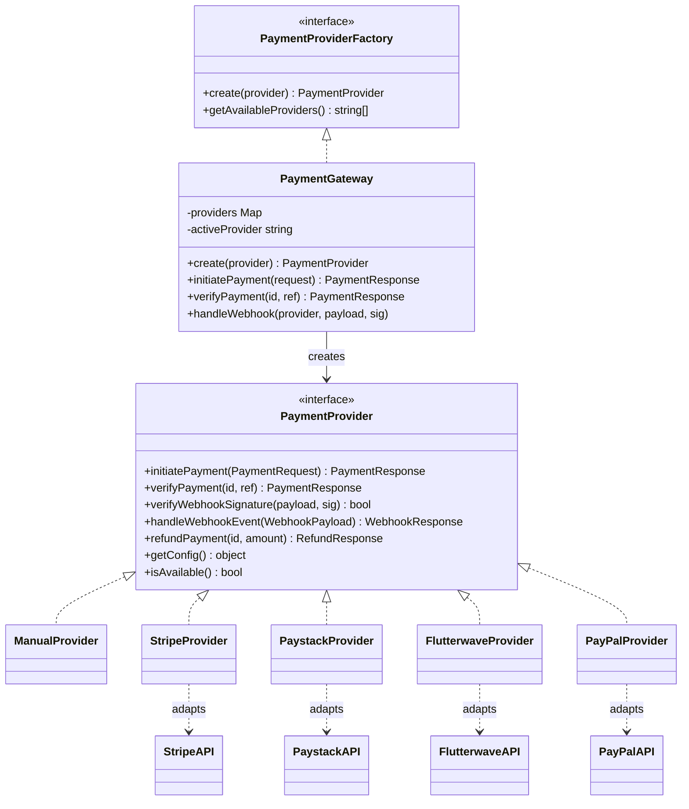

# Payment Gateway Architecture

This document describes how **Plenty Value Hub** accepts inbound payments (buyers → platform). The system uses an **Adapter + Factory + Facade** pattern so checkout code talks to one internal API while each gateway (Stripe, Paystack, etc.) keeps its own SDK/REST shape.

---

## High-level overview

```
┌─────────────────────────────────────────────────────────────────────────┐
│  Frontend (ProductDetail, AdminPaymentSettings)                          │
│  POST /api/payments/initialize  ·  POST /api/payments/verify            │
└───────────────────────────────┬─────────────────────────────────────────┘
                                │
┌───────────────────────────────▼─────────────────────────────────────────┐
│  PaymentController          WebhookController                            │
│  (HTTP entry)               (async confirmation)                         │
└───────────────────────────────┬─────────────────────────────────────────┘
                                │
┌───────────────────────────────▼─────────────────────────────────────────┐
│  paymentGateway (Facade + Factory)     PaymentValidator                  │
│  app/services/payment_gateway.ts       app/services/payment_validator.ts│
└───────────────────────────────┬─────────────────────────────────────────┘
                                │ create(provider)
        ┌───────────────────────┼───────────────────────┐
        │                       │                       │
┌───────▼────────┐   ┌──────────▼─────────┐   ┌────────▼────────┐
│ ManualProvider │   │ StripeProvider     │   │ PaystackProvider│  …
│ (in-gateway)   │   │ (Adapter)          │   │ (Adapter)       │
└───────┬────────┘   └──────────┬─────────┘   └────────┬────────┘
        │                       │                       │
        │              ┌────────▼───────────────────────▼────────┐
        │              │  Adaptees (3rd-party APIs)             │
        │              │  Stripe SDK · Paystack REST · etc.     │
        │              └───────────────────────────────────────┘
        │
┌───────▼───────────────────────────────────────────────────────────────┐
│  PaymentGatewayService + PaymentGatewayKey (encrypted DB credentials)  │
│  config/payment.ts · PaymentService (legacy settings layer)              │
└─────────────────────────────────────────────────────────────────────────┘
```

**Inbound only.** Vendor/affiliate **payouts** (platform → sellers) are separate: profile fields (`payoutMethod`, `payoutDetails`) and the wallet ledger — not handled by this gateway stack.

---

## Design patterns

| Pattern                | Role in this codebase                                                    | Where                                                     |
| ---------------------- | ------------------------------------------------------------------------ | --------------------------------------------------------- |
| **Target (interface)** | Stable contract the app expects                                          | `PaymentProvider` in `app/interfaces/payment_provider.ts` |
| **Adapter**            | Wraps each gateway’s API into `PaymentProvider`                          | `app/services/payment_providers/*.ts`                     |
| **Adaptee**            | External system with incompatible API                                    | Stripe, Paystack, Flutterwave, PayPal HTTP/SDK            |
| **Factory**            | Instantiates the correct adapter by name                                 | `PaymentGateway.create()` / `getProvider()`               |
| **Facade**             | Single entry for controllers: init, verify, webhook, refund              | `paymentGateway` singleton                                |
| **Strategy**           | Provider chosen per checkout (`paymentProvider` param or active default) | `PaymentController.initialize`                            |

---

## Target interfaces (ports)

**File:** `app/interfaces/payment_provider.ts`

These are the **Target** types — what the rest of the app depends on, independent of Stripe/Paystack/etc.

### Core request/response DTOs

| Type                                 | Purpose                                                                                                   |
| ------------------------------------ | --------------------------------------------------------------------------------------------------------- |
| `PaymentRequest`                     | Normalized checkout input: amount (**cents**), currency, email, orderId, description, returnUrl, metadata |
| `PaymentResponse`                    | Normalized result: success, transactionId, status, paymentUrl, reference                                  |
| `PaymentStatus`                      | Internal status: `pending` \| `processing` \| `completed` \| `failed` \| `cancelled`                      |
| `WebhookPayload` / `WebhookResponse` | Normalized webhook handling                                                                               |
| `RefundRequest` / `RefundResponse`   | Refund operations (implemented on adapters; not yet wired from admin UI)                                  |
| `TransactionRecord`                  | Ledger-shaped record (defined; not persisted as its own table today)                                      |

### `PaymentProvider` (adapter contract)

Every gateway adapter must implement:

```typescript
interface PaymentProvider {
  initiatePayment(request: PaymentRequest): Promise<PaymentResponse>
  verifyPayment(transactionId: string, reference?: string): Promise<PaymentResponse>
  verifyWebhookSignature(payload: string, signature: string): boolean
  handleWebhookEvent(payload: WebhookPayload): Promise<WebhookResponse>
  refundPayment(transactionId: string, amount?: number): Promise<RefundResponse>
  getConfig(): Record<string, any>
  isAvailable(): boolean | Promise<boolean>
}
```

### `PaymentProviderFactory`

```typescript
interface PaymentProviderFactory {
  create(provider: string): PaymentProvider | null
  getAvailableProviders(): Promise<string[]>
}
```

Implemented by **`PaymentGateway`**.

---

## Factory & Facade: `PaymentGateway`

**File:** `app/services/payment_gateway.ts`  
**Export:** `paymentGateway` (singleton)

### Factory behaviour

- **`getProvider(provider)`** — lazy instantiation + cache in `Map<string, PaymentProvider>`
- **`create(provider)`** — alias for `getProvider`
- Switch on provider key:

| Key           | Adapter class                          |
| ------------- | -------------------------------------- |
| `manual`      | `ManualProvider` (private inner class) |
| `stripe`      | `StripeProvider`                       |
| `paystack`    | `PaystackProvider`                     |
| `flutterwave` | `FlutterwaveProvider`                  |
| `paypal`      | `PayPalProvider`                       |

- **`getAvailableProviders()`** — returns providers that are “configured”: `manual` always; others if `PaymentGatewayService.isConfigured(name)` is true (active row in `payment_gateway_keys`).

### Facade operations (delegates to active/chosen adapter)

| Method                                                | Description                                       |
| ----------------------------------------------------- | ------------------------------------------------- |
| `initiatePayment(request, provider?)`                 | Start checkout; returns redirect URL / session id |
| `verifyPayment(transactionId, reference?, provider?)` | Poll/confirm payment                              |
| `handleWebhook(provider, payload, signature)`         | Verify signature → parse → `handleWebhookEvent`   |
| `refundPayment(transactionId, amount?, provider?)`    | Provider refund                                   |
| `validateAmount(amount)`                              | Min/max from `config/payment.ts` limits           |
| `isCurrencySupported(currency, provider?)`            | Per-provider currency list                        |
| `getWebhookUrl` / `getAllWebhookEndpoints`            | Build webhook URLs for admin setup                |

**Default provider:** `paymentConfig.defaultProvider` (env `PAYMENT_DEFAULT_PROVIDER`, fallback `manual`).

---

## Adapters (implementations)

Each adapter **implements `PaymentProvider`** and **translates** between internal DTOs and the **Adaptee** API.

### Summary table

| Adapter                 | File                         | Adaptee                                                                | Auth / client                           | Init flow                                  | Verify key                        |
| ----------------------- | ---------------------------- | ---------------------------------------------------------------------- | --------------------------------------- | ------------------------------------------ | --------------------------------- |
| **ManualProvider**      | `payment_gateway.ts` (inner) | None                                                                   | N/A                                     | No redirect; order completed in controller | Always “pending” / N/A            |
| **StripeProvider**      | `stripe_provider.ts`         | [Stripe API](https://stripe.com/docs/api)                              | `stripe` npm SDK; secret from DB or env | Checkout Session                           | Session id → PaymentIntent status |
| **PaystackProvider**    | `paystack_provider.ts`       | [Paystack REST](https://paystack.com/docs/api/)                        | Axios + Bearer secret                   | `POST /transaction/initialize`             | `GET /transaction/verify/:ref`    |
| **FlutterwaveProvider** | `flutterwave_provider.ts`    | [Flutterwave v3](https://developer.flutterwave.com/)                   | Axios + Bearer secret                   | `POST /payments`                           | `GET /transactions/:id/verify`    |
| **PayPalProvider**      | `paypal_provider.ts`         | [PayPal Checkout v2](https://developer.paypal.com/docs/api/orders/v2/) | OAuth2 client credentials               | `POST /v2/checkout/orders`                 | `GET /v2/checkout/orders/:id`     |

### Adapter details

#### ManualProvider (built-in)

- **Adaptee:** none — offline / admin-trusted checkout.
- **`initiatePayment`:** returns success with synthetic `manual_*` transaction id.
- **`verifyPayment`:** always `success: false` (completion is immediate in `PaymentController` for manual).
- Webhooks/refunds: explicitly unsupported.

#### StripeProvider

- **Adaptee:** Stripe Checkout Sessions + PaymentIntents.
- **Credentials:** `PaymentGatewayService.getCredential('stripe', 'secretKey')` or `config/payment.ts` env fallback.
- **Amount:** passed through as **cents** in `price_data.unit_amount`.
- **Webhook signature:** HMAC-SHA256 (simplified; production should use Stripe’s `constructEvent`).
- **Events handled:** `charge.succeeded`, `charge.failed`, `charge.refunded`.

#### PaystackProvider

- **Adaptee:** Paystack Transaction API.
- **Reference:** uses `request.orderId` (order number) as Paystack `reference`.
- **Amount:** expects **kobo/cents** in initialize body (controller sends cents).
- **Webhook:** `charge.success` / `charge.failed`; signature header `x-paystack-signature` (HMAC-SHA512).

#### FlutterwaveProvider

- **Adaptee:** Flutterwave Standard Payments.
- **Amount:** adapter converts **cents → major units** (`amount / 100`) for API.
- **Reference:** `tx_ref = orderId`.
- **Webhook:** `verif-hash` header; events `charge.completed`, `charge.failed`.

#### PayPalProvider

- **Adaptee:** Orders v2 + Captures.
- **Amount:** converts cents → decimal string for `purchase_units[].amount.value`.
- **OAuth:** token cached with expiry; credentials as `clientId` / `clientSecret` from DB.
- **Webhook signature:** stub returns `true` (needs PayPal verification endpoint in production).

---

## Configuration layers (three sources)

The system merges configuration from three places — important when tracing “why is Paystack enabled?”.

```
┌─────────────────────┐     ┌──────────────────────────┐     ┌─────────────────────┐
│ config/payment.ts   │     │ payment_gateway_keys     │     │ site_settings       │
│ Env vars, limits,   │     │ Encrypted keys per       │     │ payment_settings    │
│ webhook paths,      │     │ gateway (is_active)      │     │ JSON: activeProvider│
│ currency defaults   │     │ PaymentGatewayKey model  │     │ currency, providers │
└─────────┬───────────┘     └────────────┬─────────────┘     └──────────┬──────────┘
          │                              │                               │
          └──────────────────────────────┼───────────────────────────────┘
                                         │
                              PaymentGatewayService (cache, 1h TTL)
                              PaymentService (normalize + public config)
```

| Layer                    | File / table                                 | Responsibility                                                                                                    |
| ------------------------ | -------------------------------------------- | ----------------------------------------------------------------------------------------------------------------- |
| **Runtime config**       | `config/payment.ts`                          | Default provider, env API keys, webhook base URL, min/max amounts, supported currencies per provider              |
| **UI registry**          | `config/paymentProviders.ts`                 | Branding, logos, marketing copy, currency lists for frontend `ProviderSelector`                                   |
| **Secrets (preferred)**  | `payment_gateway_keys` + `PaymentGatewayKey` | AES-256-CBC encrypted `publicKey`, `secretKey`, `webhookSecret`; `isActive` flag                                  |
| **Legacy settings blob** | `site_settings.key = payment_settings`       | `PaymentService` JSON: `activeProvider`, `currency`, provider enable flags — merged with DB keys in `getConfig()` |

**Admin APIs:**

- `PaymentSettingsController` — CRUD on `payment_gateway_keys` (`/api/admin/payment-gateway-settings/*`)
- `SiteSettingsController` — read/write `payment_settings` via `PaymentService`

**Public-safe config:** `PaymentService.getPublicConfig()` strips secrets for checkout UI and Inertia pages.

---

## Legacy service: `PaymentService`

**File:** `app/services/payment_service.ts`

Older **monolithic** implementation: same five providers but implemented as **private static methods** with raw `fetch()` (no `PaymentProvider` interface).

| Still used for                                       | Replaced by (for new code)                        |
| ---------------------------------------------------- | ------------------------------------------------- |
| `getConfig()` / `saveConfig()` / `getPublicConfig()` | Still primary for currency + provider list in SSR |
| `initializePayment()` / `verifyPayment()`            | **`paymentGateway`** in `PaymentController`       |

When reading the repo, treat **`paymentGateway` + adapters** as the active checkout path; **`PaymentService`** as settings/normalization + historical duplicate API calls.

---

## HTTP flow

### 1. Initialize checkout

```
Client                    PaymentController              paymentGateway           Adapter              Adaptee
  │                              │                            │                    │                    │
  │ POST /api/payments/initialize│                            │                    │                    │
  ├─────────────────────────────►│ validate provider          │                    │                    │
  │                              │ RevenueService.calculate   │                    │                    │
  │                              │ Order.create (pending)     │                    │                    │
  │                              │ WalletService.handleOrderCreated              │                    │
  │                              │ initiatePayment(request)   │                    │                    │
  │                              ├───────────────────────────►│ create(provider)   │                    │
  │                              │                            ├───────────────────►│ initiatePayment    │
  │                              │                            │                    ├───────────────────►│
  │                              │                            │◄───────────────────┤ paymentUrl         │
  │◄─────────────────────────────┤ JSON: paymentUrl, order    │                    │                    │
```

**Manual path:** skips gateway; order created as `completed` immediately; `postOrderComplete` runs (stats, wallet, emails).

**Gateway path:** order `pending` → redirect user to `paymentUrl` → complete via verify or webhook.

### 2. Verify (client callback)

```
POST /api/payments/verify  { reference, provider }
  → PaymentValidator
  → paymentGateway.verifyPayment(reference, reference, provider)
  → order.status = completed → postOrderComplete
```

### 3. Webhook (server-to-server)

```
POST /api/payments/webhook/:provider  (CSRF exempt)
  → WebhookController (provider-specific headers: stripe-signature, x-paystack-signature, verif-hash, …)
  → paymentGateway.handleWebhook
  → adapter.verifyWebhookSignature + handleWebhookEvent
  → completeOrderByReference(reference) → wallet + notifications
```

Dedicated routes also exist: `/webhook/stripe`, `/webhook/paystack`, `/webhook/flutterwave`, `/webhook/paypal`.

---

## Validation

**File:** `app/services/payment_validator.ts`

| Check                                 | Used when          |
| ------------------------------------- | ------------------ |
| Amount within `paymentConfig.limits`  | Request validation |
| Currency supported by active provider | Request validation |
| Email, orderId, description           | Request validation |
| Provider in `getAvailableProviders()` | Initialize         |
| Transaction id format                 | Verify             |
| Webhook payload + signature present   | Webhook            |

Errors: `PaymentValidationError`, `PaymentProcessingError` → `formatErrorResponse()`.

---

## Controllers & routes

| Route                                                | Controller                             | Notes                                           |
| ---------------------------------------------------- | -------------------------------------- | ----------------------------------------------- |
| `GET /api/payment-providers`                         | `PaymentController.providers`          | Public enabled providers                        |
| `GET /api/payment-settings`                          | `SiteSettingsController.paymentConfig` | Full settings (admin-oriented)                  |
| `POST /api/payments/initialize`                      | `PaymentController.initialize`         | Auth optional (guest email)                     |
| `POST /api/payments/verify`                          | `PaymentController.verify`             | Auth optional                                   |
| `POST /api/payments/webhook/*`                       | `WebhookController`                    | Public, no CSRF                                 |
| `GET/POST/PUT /api/admin/payment-gateway-settings/*` | `PaymentSettingsController`            | Encrypted key management                        |
| `POST /api/orders`                                   | `OrdersController.processOrder`        | **Legacy** direct order (bypasses gateway init) |

**Validators:** `app/validators/payment.ts` — Vine schemas for initialize, verify, settings.

---

## Post-payment side effects

On successful completion (`PaymentController.postOrderComplete` or `WebhookController.completeOrderByReference`):

1. **AffiliateLink** — conversions, revenue, commission_earned
2. **Product** — totalSales, totalRevenue, gravityScore
3. **WalletService.handleOrderCompleted** — vendor + affiliate ledger credits
4. **NotificationService.notifyOrderCompleted** — emails to buyer, vendor, affiliate, admin

**Revenue split** (`RevenueService`): 10% platform fee; affiliate commission from product `commissionRate`; remainder = vendor payout.

---

## Frontend integration

| Component                  | Path                          | Role                                                                          |
| -------------------------- | ----------------------------- | ----------------------------------------------------------------------------- |
| `ProductDetail.tsx`        | `inertia/pages/`              | Provider selection, `POST /api/payments/initialize`, redirect to `paymentUrl` |
| `ProviderSelector`         | `inertia/components/payment/` | Branded provider picker (uses `config/paymentProviders.ts` metadata)          |
| `ProviderLogo`             | same                          | SVG logos under `public/logos/`                                               |
| `AdminPaymentSettings.tsx` | `inertia/pages/admin/`        | Admin UI for gateways + currency                                              |

Payment props are server-rendered from `PagesController.productDetail` using `PaymentService.getPublicConfig()`.

---

## Class diagram (Adapter + Factory)



---

## File index

| Concern                               | Path                                                     |
| ------------------------------------- | -------------------------------------------------------- |
| **Interfaces (Target)**               | `app/interfaces/payment_provider.ts`                     |
| **Factory + Facade + Manual adapter** | `app/services/payment_gateway.ts`                        |
| **Stripe adapter**                    | `app/services/payment_providers/stripe_provider.ts`      |
| **Paystack adapter**                  | `app/services/payment_providers/paystack_provider.ts`    |
| **Flutterwave adapter**               | `app/services/payment_providers/flutterwave_provider.ts` |
| **PayPal adapter**                    | `app/services/payment_providers/paypal_provider.ts`      |
| **Credential cache / DB access**      | `app/services/payment_gateway_service.ts`                |
| **Legacy settings + raw fetch**       | `app/services/payment_service.ts`                        |
| **Validation**                        | `app/services/payment_validator.ts`                      |
| **Encrypted credentials model**       | `app/models/payment_gateway_key.ts`                      |
| **Env + limits config**               | `config/payment.ts`                                      |
| **UI provider registry**              | `config/paymentProviders.ts`                             |
| **Checkout HTTP**                     | `app/controllers/payment_controller.ts`                  |
| **Webhook HTTP**                      | `app/controllers/webhook_controller.ts`                  |
| **Admin keys HTTP**                   | `app/controllers/payment_settings_controller.ts`         |
| **Request schemas**                   | `app/validators/payment.ts`                              |

---

## Known gaps & dual paths

1. **Two implementations** — `PaymentService` (fetch) vs adapter classes; controllers use **`paymentGateway`** for checkout.
2. **Legacy order API** — `POST /api/orders` creates completed orders without gateway init or full notification parity.
3. **Webhook reference extraction** — Stripe/PayPal webhooks may not always populate `reference` for `completeOrderByReference`; client-side **verify** is the reliable fallback.
4. **PayPal webhook verification** — stubbed (`verifyWebhookSignature` returns `true`).
5. **Refunds** — adapters implement `refundPayment`; admin order refund flow uses status update + aggregate reversal, not gateway refund API.
6. **Amount units** — internal convention is **cents** in `PaymentRequest`; Paystack/Flutterwave adapters assume controller passes cents; Flutterwave divides by 100 for API.

---

## Environment variables (reference)

From `config/payment.ts`:

| Variable                                                                       | Provider                          |
| ------------------------------------------------------------------------------ | --------------------------------- |
| `PAYMENT_DEFAULT_PROVIDER`                                                     | Global default (e.g. `manual`)    |
| `PAYMENT_CURRENCY`                                                             | Default checkout currency         |
| `PAYMENT_WEBHOOK_URL_BASE`                                                     | Base URL for webhook registration |
| `STRIPE_PUBLIC_KEY`, `STRIPE_SECRET_KEY`, `STRIPE_WEBHOOK_SECRET`              | Stripe                            |
| `PAYSTACK_PUBLIC_KEY`, `PAYSTACK_SECRET_KEY`, `PAYSTACK_WEBHOOK_SECRET`        | Paystack                          |
| `FLUTTERWAVE_*`                                                                | Flutterwave                       |
| `PAYPAL_CLIENT_ID`, `PAYPAL_CLIENT_SECRET`, `PAYPAL_MODE`, `PAYPAL_WEBHOOK_ID` | PayPal                            |

Production should prefer **`payment_gateway_keys`** (encrypted at rest with `APP_KEY`) over plain env for secrets.
